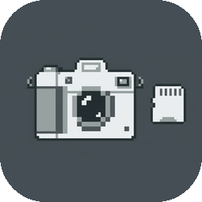

# Auto Screen Snap

A lightweight macOS menu bar app that automatically captures screenshots of your active window at a set interval — perfect for creating timelapse showreels of your work.



## Features

- **Window-only capture** — captures just the frontmost app's window, not the full screen
- **Menu bar app** — lives quietly in your menu bar, no Dock icon
- **Auto-organises saves** — `~/Desktop/screensnap/{AppName}/` created automatically
- **JPEG output** — compressed, timestamped files: `AppName_2026-03-06_13-45-22.jpg`
- **5-second interval** — ideal for timelapse showreels
- **Test Screenshot** — one-shot capture to preview instantly

## Requirements

- macOS 14.0+
- Xcode (to build)
- An Apple Developer certificate (for persistent Screen Recording permission)

## Build & Install

```bash
bash install.sh
```

This will:
1. Build the Release binary via Xcode
2. Sign it with your Apple Development certificate
3. Place `AutoScreenSnap.app` in the project folder
4. Launch the app automatically

On first run, grant **Screen Recording** permission when prompted — this is required once and persists permanently.

## Usage

1. Launch `AutoScreenSnap.app`
2. Switch to the app you want to capture
3. Click the camera icon in the menu bar → **Start Capturing**
4. Screenshots save automatically every 5 seconds
5. Click **Open Snapshots Folder** to browse your captures

## Save Location

```
~/Desktop/screensnap/
├── Cursor/
│   ├── Cursor_2026-03-06_09-00-00.jpg
│   └── ...
├── Godot/
│   └── ...
```

## Making a Timelapse

Since every filename contains a timestamp, you can assemble images into a video with automatic date subtitles using FFmpeg. Ask in the repo issues for a ready-made script.

## License

MIT
